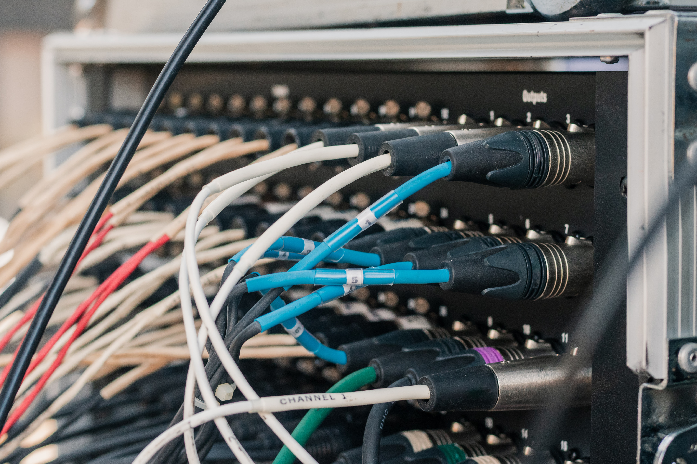

# (PART) Install FAQ {#install}

# What is the install FAQ?

```{r echo=FALSE, out.width='100%'}

```

This chapter is dedicated to install issues related to:

- R
- RStudio
- R packages
- general operating system issues linked to installation

<!-- ## Unable to install latest R version -->


<!-- ## Unable to locate R binary by scanning standard locations -->


<!-- ## Required package versions could not be found  -->


<!-- ## The git command requires the command line developer tools. Would you like to install the tools now? -->


<!-- This window appears on macOS systems when RStudio is opened for the first time. Approving the install activates additional functionality such as git control and package development.  -->
<!-- For students, installing the tools is **optional**.  -->
<!-- We recommend that you click on "Install" now if you are interested in [version control](https://www.atlassian.com/git/tutorials/what-is-version-control) for your documents and code. -->
